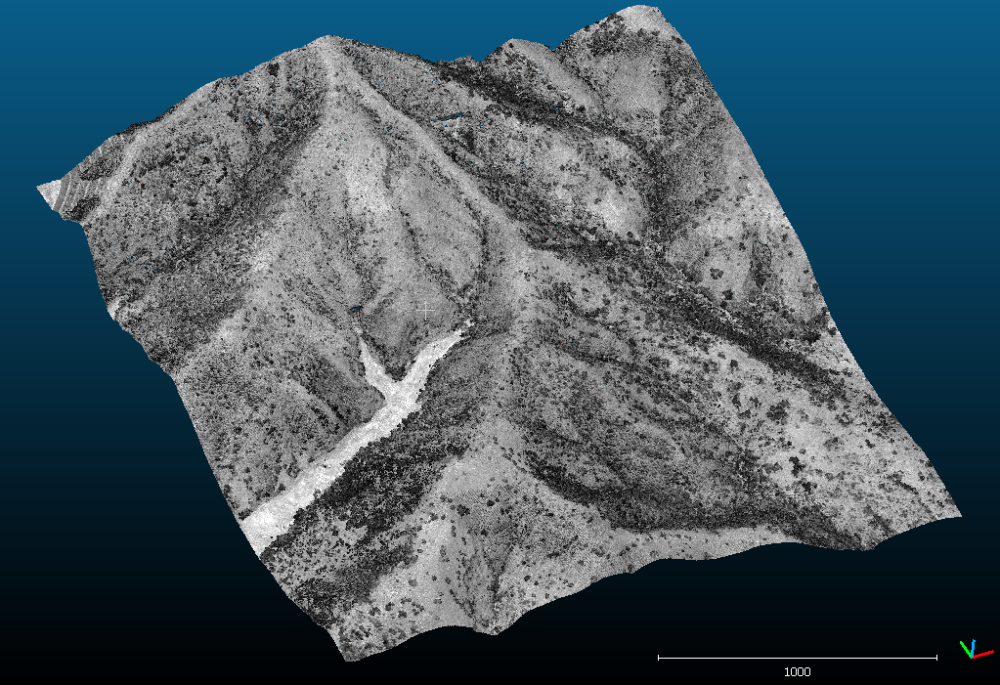
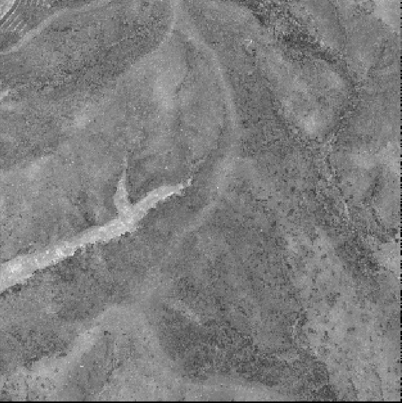
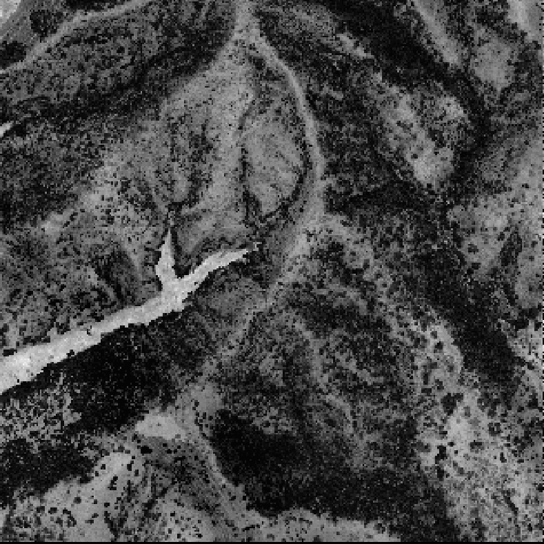
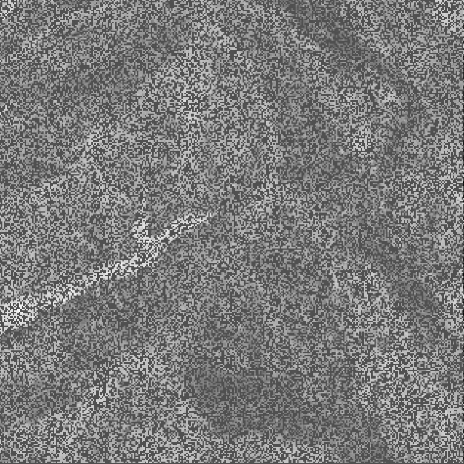
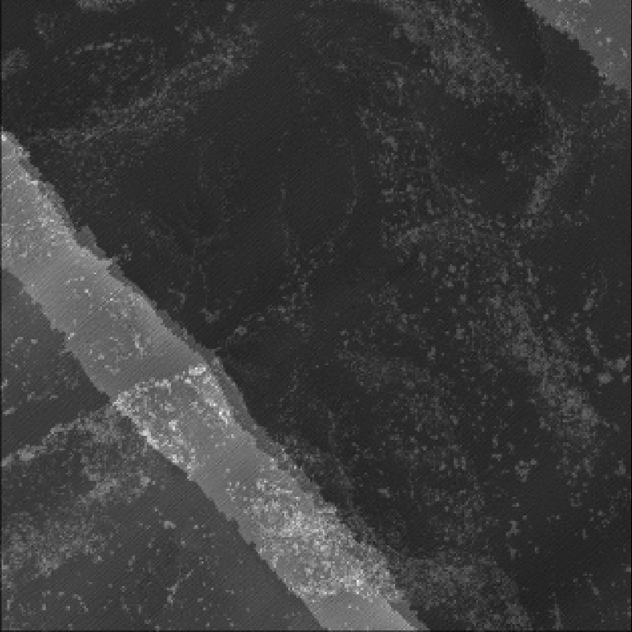
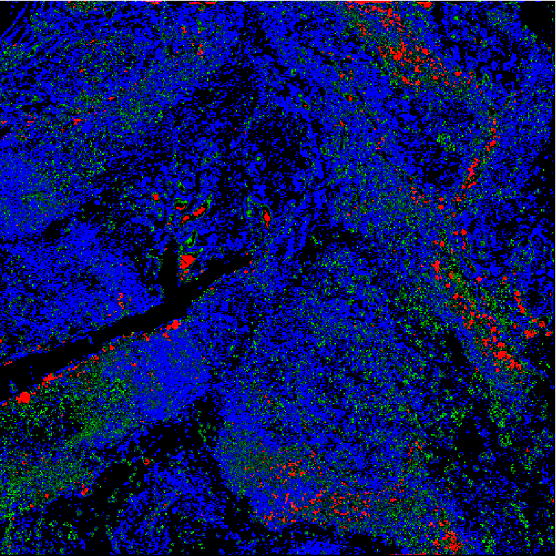
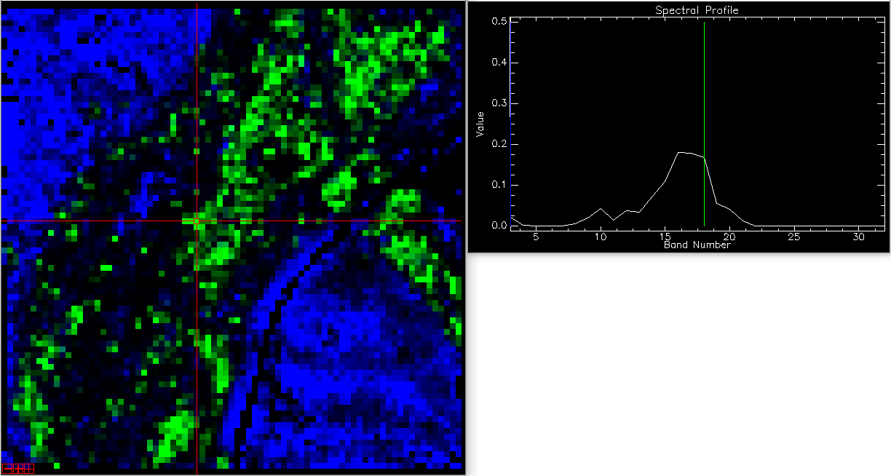
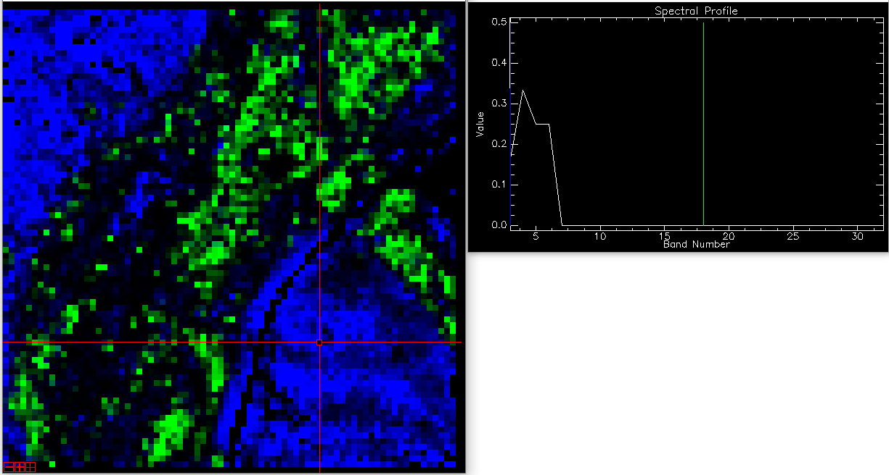

# LiDAR Raster Stats

Library to convert PCL point clouds (e.g. as loaded from .PCD files) of land scenes to raster format. Calculates a set of input statistics over all points within each output raster pixel. Rasters can be generated with user-specified CRS (independent of input cloud CRS), origin, and resolution. Users can also specify which point field is used (e.g. vegetation height, return intensity, z value, etc.). 

# Usage

Building:

Make sure you have [proj](https://proj.org/), [GDAL](https://gdal.org/), and [PCL](https://pointclouds.org/) installed. To compile the example executable you'll also need the LAS processing library [dirt_or_leaf](https://github.com/conormcmahon/dirt_or_leaf). 

To run within cloned git repository, following build: 

```
raster_stats_tester INPUT_FILENAME OUTPUT_FILENAME FIELD_NAME PIXEL_SIZE HISTOGRAM_MIN HISTOGRAM_MAX HISTOGRAM_BINS EPSG_INPUT EPSG_OUTPUT

  INPUT_FILENAME  - string value containing entire path to input filename, including filetype (e.g. "/home/foo/input_cloud.pcd")
  OUTPUT_FILENAME - string value containing entire path to output filename, but NOT including filetype (e.g. "/home/foo/raster_out")
  FIELD_NAME      - name of field from point cloud to use for raster outputs (e.g. "intensity", "height", "z"...)
  PIXEL_SIZE      - X/Y pixel dimensions for output raster, in output georeferenced units
  HISTOGRAM_MIN   - minimum bin value for histogram raster. If this and max are both set to 0, the histogram range will be separately calculated for each pixel.
  HISTOGRAM_MAX   - maximum bin value for histogram raster. If this and min are both set to 0, the histogram range will be separately calculated for each pixel.
  HISTOGRAM_BINS  - number of bins to be used in histogram
  EPSG_INPUT      - EPSG code with the CRS of the input point cloud dataset
  EPSG_OUTPUT     - EPSG code that point cloud data will be reprojected to prior to rasterizing. If none is specified, no reprojection occurs.
```

# Example Images

## Input Cloud


Example image showing the input 3D point cloud for which raster are generated below. The cloud is colored by return intensity.

Currently, only four stats are included, illustrated here using the intensity information above. Histograms can also be extracted which show the distribution of point values within each pixel. 

## Maximum Image


Maximum within each raster pixel.

## Minimum Image


Minimum within each raster pixel.

## Median Image


Median within each raster pixel.

## Point Density Image


Total number of points (cloud density) within each raster pixel.

## Histogram Image


Histogram of point heights within image, aggregated at 5 ft pixel scale with 10 height bins. Red band is high vegetation, green is medium, and blue is near-ground returns. 

At another area along a major river, the following height histograms were extracted for comparison between vegetation types. All of the following histograms are with pixels aggregated at 10 m resolution with 20 bins, ranging from 0 to 20 m height. 


Gallery riparian trees, probably sycamore or cottonwood. 


Lower riparian trees, probably willow.


Chaparral vegetation. 
